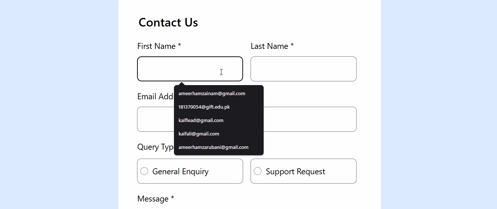
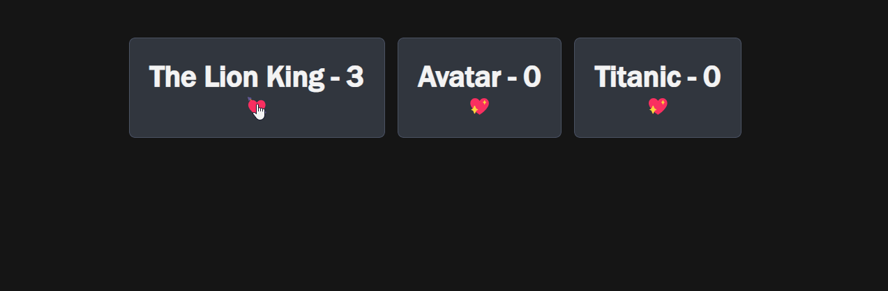
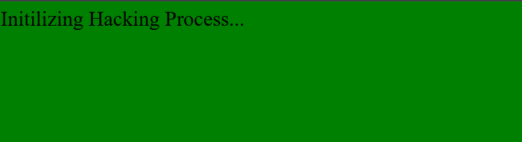


# MERN-Stack Internship Devsloop
## Weeks 6-9 (React):
## Week 7:
### Topics:
- Advanced component patterns: Higher order Components ✅, props drilling ( leads to week 8 and will work there ) ✅
- Pure components ✅, smart/dumb components✅ , (Redux Toolkit, Persist in ReduxToolkit, RTK Query )
### Exercises:
- Build a multi-component app with optimized data flow.

## Week 6:
### Topics:
- React introduction: JSX, components, state vs props
- Lifecycle methods, React hooks (useState, use effect), custom hooks
### Exercises:
- Build a small React app with a dynamic state.

## Week 5:
- Typescript ⚠️ ( onGoing )
- Error handling, debugging techniques ✅
- Introduction to JSON and using external APIs ✅
### Exercises:
- Build a small project utilizing an API and handle errors.✅

## week 4:
- Classes ✅, OOP principles( inheritance,  encapsulation, abstraction, polyorphyism)✅, Functional programming ✅, Constructor Functions✅, Factory Functions✅
- Inheritance in Javascript✅
- Closures✅
- Lexical scope✅
- Hoisting✅
- Coercion✅
- This (this.something)   Keyword in javascript and its nightmares ✅
- Immutability✅

## week 3:
- DOM manipulation and event handling ✅
- Advanced ES6+ features (destructuring, template literals, spread operator, rest operator, Optional Chaining Operator, Nullish Coalescing Operator) ✅
- Sync vs Async JavaScript (callbacks, promises, async/await/Fetch API) ✅
- Event Loop ✅
- Execution Control and flow ✅
### Exercise:
 Create interactive web elements and simple web apps using APIs. ✅

## Week 2:
### Topics:
- JavaScript fundamentals: data types (Primitives), variables, scope, functions, loops ✅
- Non-primitive data types => Arrays, objects, and their methods ✅
- IIFE and Arrow functions ✅
- Creating/Accessing Arrays/Objects ✅
- Exercises: Write functions for array manipulation ✅ and DOM interaction. ✅
### Exercises:
Write functions for array manipulation ✅ and DOM interaction. ✅

## Weeks 1 (HTML and CSS):
### Topics:(HTML) 2 days
- Structure and semantics of HTML5 ✅
- Key HTML tags (including forms, lists, and tables) ✅
- Form validation and input types ✅
- HTML accessibility ✅
- DOM introduction and basics ✅
### Exercises:
 Build pages with proper layout, forms, and semantic tags.✅
 
 

### Topics: (CSS) 3 days
- CSS basics (selectors, box model) ✅
- Advanced CSS (flexbox, grid, media queries) ✅
- Responsive design ✅ and CSS frameworks (SASS, Tailwind) ❌
 ### Exercises:
 Add responsive styling to previous HTML exercises. ✅
 
 

[def]: useStateLikeBUtton.gif