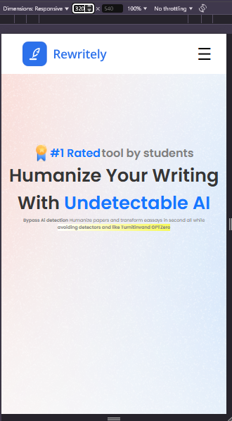

# MERNStackInterneeDevsloop

  
## Weeks 1 (HTML and CSS):
### Topics:(HTML) 2 days
- Structure and semantics of HTML5 ✅
- Key HTML tags (including forms, lists, and tables) ✅
- Form validation and input types ✅
- HTML accessibility ✅
- DOM introduction and basics ✅

 
 

### Topics: (CSS) 3 days
- CSS basics (selectors, box model) ✅
- Advanced CSS (flexbox, grid, media queries) ✅
- Responsive design ✅ and CSS frameworks (SASS, Tailwind) ❌
 
 

## Week 2:
### Topics:
- JavaScript fundamentals: data types (Primitives), variables, scope, functions, loops ✅
- Non-primitive data types => Arrays, objects, and their methods ✅
- Exercises: Write functions for array manipulation ✅ and DOM interaction. ❌
